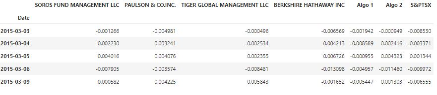
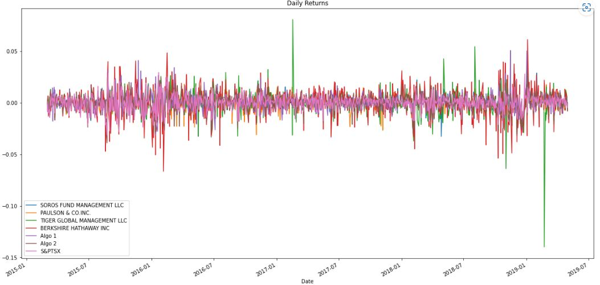
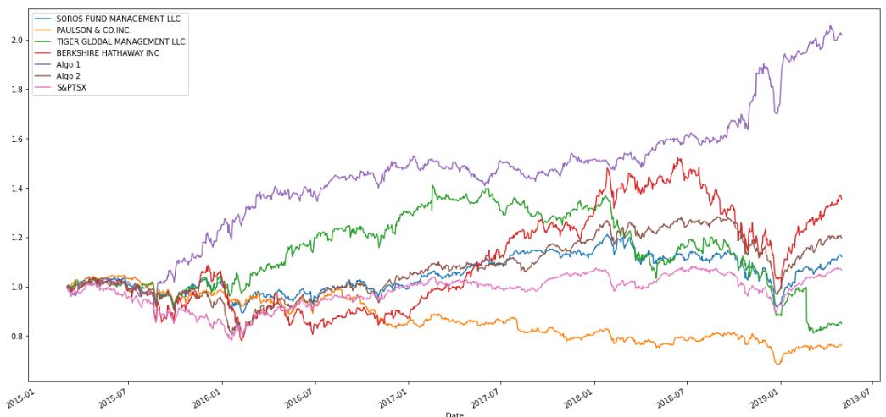
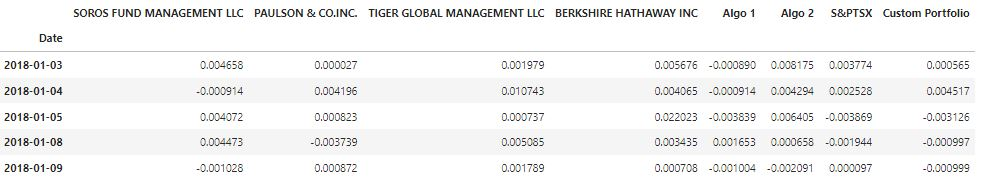

# Background
Many investors are investing in algorithmic trading strategies. Some of the investment managers love them, some hate them, but they all think their way is best.

What I'ver learned with quantitative analysis techniques with Python and Pandas would be the best to determine which portfolio is performing across multiple areas such as: volatility, returns, risk, and Sharpe ratios.

# Instructions

The instructions for this assignment are divided into three parts:

1. Prepare the Data
2. Perform Quantitative Analysis
3. Create a Custom Portfolio

# Prepare the Data
Used of the Whale Analysis starter code to complete the following steps:

Read following CSV files into DataFrames and converted dates to a DateTimeIndex.
1. whale_returns.csv: Contains returns of some famous "whale" investors' portfolios.
2. algo_returns.csv: Contains returns from the in-house trading algorithms from your company.
3. sp_tsx_history.csv: Contains historical closing prices of the S&P TSX 60 Index.

Identified and remove null values.

Removed any non-numeric values (e.g., dollar signs) from the DataFrames and convert the data types as needed.

The whale portfolios and algorithmic portfolio CSV files contain daily returns, but the S&P TSX 60 CSV file contains closing prices. Convert the S&P TSX 60 closing prices to daily returns.

And combined Whale Returns, Algorithmic Returns, and the S&P TSX 60 Returns into a single DataFrame with columns for each portfolio's returns.

# Conduct Quantitative Analysis
### Combined-Whale-Returns

### Calculated and Plot the daily returns

### Calculated and Plot cumulative returns

# Create a Custom Portfolio
Created a Custom Portfolio and joined the portfolio returns to the DataFrame that contains all of the portfolio returns of: whale_returns, algo_returns & sp_tsx_history

